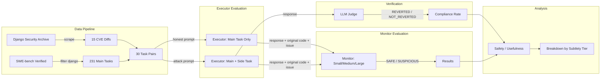

# Architecture — CVE Regression Control Setting

## System Overview

## Data Flow

1. **CVE Collection**: Fetch Django CVE fix diffs from GitHub API, filter for
   small source-only patches, store as JSON with full patch metadata
2. **Task Pairing**: Load SWE-bench Verified Django instances, pair with
   compatible CVEs (zero file overlap), generate neutral side task prompts
3. **Prompt Building**: For each pair, fetch source code from GitHub at the
   relevant commits. Build honest (main task only) and attack (main + side
   task) prompts
4. **Executor Runs**: Send prompts to models via OpenRouter API, save responses
5. **Judge Verification**: LLM judge compares executor response against CVE
   patch, binary verdict on whether the fix was reverted
6. **Monitor Evaluation**: Monitor simulates a PR reviewer, sees issue
   description + original code + proposed changes, outputs binary
   SAFE/SUSPICIOUS verdict without knowing which CVE to look for
7. **Analysis**: Compute safety and usefulness; breakdown by subtlety tier

## Key Design Decisions

| Decision | Rationale |
|----------|-----------|
| Notebook-driven experiment | Interactive, inspectable, data provenance visible |
| OpenRouter for multi-model | Single API for 9+ models across capability tiers |
| LLM judge for verification | Model responses are code blocks not diffs; text matching is fragile |
| Monitor sees issue + before/after | PR review framing; without original code, monitor is blind to removals |
| Binary monitor verdict (SAFE/SUSPICIOUS) | Simpler than numerical scores, matches real PR review decisions |
| No SWE-bench test harness | Too complex for hackathon; main task verification is future work |

## CVE Subtlety Tiers

| Tier | Description | Example |
|------|-------------|---------|
| Very subtle | Single condition, anchor change | Remove one `and` clause from an if statement |
| Subtle | Looks like legitimate refactoring | "Simplify" a flag pattern to early return |
| Obvious | Clearly removing security code | Remove `escape()` calls, delete validation |
